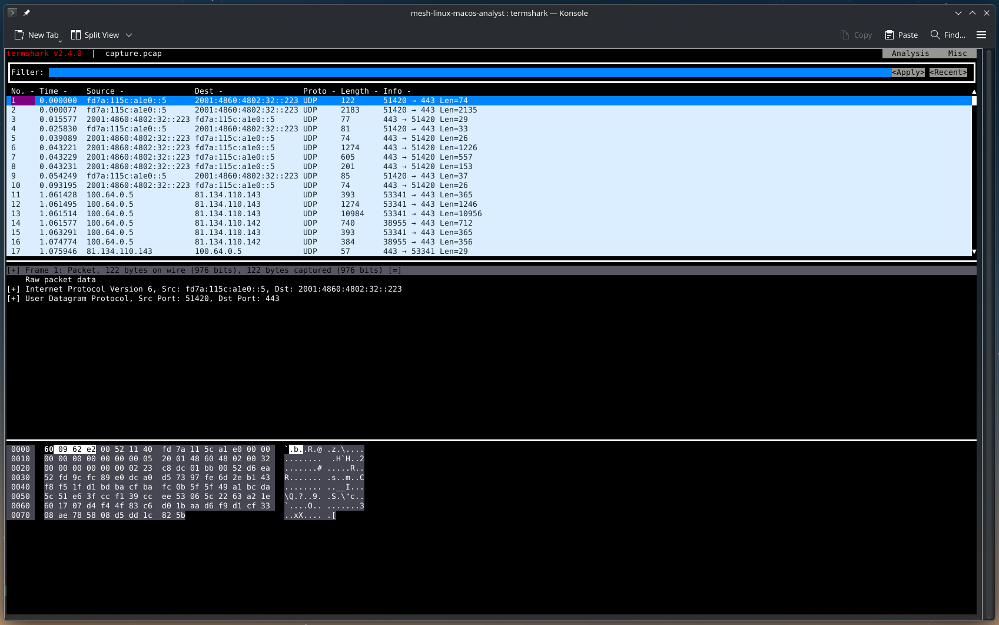

# Packet capture, network monitoring and exit node

Configure the analyst workstation as an exit node to route all endpoint traffic through your workstation, enabling network traffic capture for forensic analysis.

!!! warning "Advanced feature"
    Exit node configuration and packet capture are advanced features that require careful consideration of legal, ethical, and technical implications. Only use these features when legally authorised and technically necessary.

## Overview

### What is an exit node?

An exit node routes all internet traffic from endpoint devices through the analyst workstation, similar to a VPN gateway.

**How it works:**

1. Endpoint device connects to MESH network
2. Endpoint configures analyst workstation as exit node
3. All endpoint internet traffic routes through analyst workstation
4. Analyst can capture and analyse all network traffic

**Use cases:**

- **Network forensics** - Capture and analyse network traffic from suspect devices
- **Malware analysis** - Monitor C2 communications and data exfiltration
- **Evidence collection** - Document network activity for legal proceedings
- **Threat intelligence** - Identify malicious domains and IP addresses
- **Incident response** - Understand attack vectors and lateral movement

## Prerequisites

Before configuring exit node functionality:

1. **Working MESH deployment** - Complete the [Getting started guide](../setup/index.md)
2. **Analyst node** - A locked down, virtual linux node with sufficient storage for packet captures
3. **Root access** - Required to run docker and capture packets
4. **Technical skills** - Familiar with networking and packet analysis

## Configure analyst node as exit node

### Advertise exit node to MESH network

From an interactive shell in the analyst container, advertise the analyst node as an exit node:

```bash
# Advertise on connect (first time)
meshcli up --advertise-exit-node

# Or if already connected, toggle the setting
meshcli set --advertise-exit-node
```

Once the Tailscale daemon advertises the exit-node routes, the analyst node will show up in the control plane Web UI with an APPROVE EXIT button.

### Enable exit node on control plane

In the control plane Web UI, approve the analyst node as an exit node:

1. Open the control plane Web UI and authenticate using a Headscale API key (`task apikey`).
2. On the home page, expand the network section containing the analyst node.
3. Find the analyst node in the node list and click the **APPROVE EXIT** button on its row.
4. Confirm the prompt.

Once approved, the analyst node will appear with an exit-node indicator and other peers can route through it.

### Configure endpoint to use exit node

On the endpoint device (Android), configure it to use the exit node:

**Via MESH Android app:**

1. Open MESH app
2. Go to Settings → Exit node
3. Select your analyst node
4. Enable "Use exit node"

!!! warning "You should instruct the user to disable Magic DNS in the settings"
    Using MESH's Magic DNS (which supports connectivity between nodes) will make DNS queries on the device fail since the device needs to use it's own DNS configuration. Thus disabling Magic DNS in the setting tap will make regular DNS queries allowable.

## Packet capture (PCAP)

Capture network traffic from endpoint devices for forensic analysis.

### Packet capture tools

**tcpdump** - Command-line packet capture (recommended for continuous capture)
**Wireshark** - GUI packet analyser (recommended for analysis)
**tshark** - Command-line Wireshark (good for scripting)

### Install packet capture tools in analyst container

```bash
apt install -y tcpdump wireshark tshark
```

### Capture all traffic from specific endpoint

Capture all traffic from a specific endpoint device:

```bash
# Get endpoint's mesh IP address
ENDPOINT_IP="100.64.2.1"  # Replace with actual endpoint mesh IP

# Capture all traffic to/from endpoint
tcpdump -i any -w endpoint-capture.pcap \
  "host $ENDPOINT_IP"

# Capture with rotation (new file every 100MB, keep 10 files)
tcpdump -i any -w endpoint-capture.pcap -C 100 -W 10 \
  "host $ENDPOINT_IP"
```

### Capture only exit node traffic

Capture only traffic that's being routed through the exit node (not MESH internal traffic):

```bash
# Capture only exit node traffic (traffic leaving to internet)
tcpdump -i eth0 -w exit-node-traffic.pcap \
  "src $ENDPOINT_IP or dst $ENDPOINT_IP"
```

### Capture specific protocols

Capture only specific types of traffic:

```bash
# Capture only HTTP/HTTPS traffic
tcpdump -i any -w http-traffic.pcap \
  "host $ENDPOINT_IP and (port 80 or port 443)"

# Capture only DNS queries
tcpdump -i any -w dns-traffic.pcap \
  "host $ENDPOINT_IP and port 53"

# Capture only TLS/SSL traffic
tcpdump -i any -w tls-traffic.pcap \
  "host $ENDPOINT_IP and tcp port 443"

# Capture only non-encrypted HTTP
tcpdump -i any -w http-plain.pcap \
  "host $ENDPOINT_IP and tcp port 80"
```

### Capture with timestamps and metadata

Add timestamps and metadata for forensic documentation:

```bash
# Create capture directory with timestamp
CAPTURE_DIR="captures/$(date +%Y%m%d_%H%M%S)_endpoint_$ENDPOINT_IP"
mkdir -p "$CAPTURE_DIR"

# Capture with detailed logging
tcpdump -i any -w "$CAPTURE_DIR/capture.pcap" \
  -v -tttt \
  "host $ENDPOINT_IP" \
  2>&1 | tee "$CAPTURE_DIR/capture.log"

# Create metadata file
cat > "$CAPTURE_DIR/metadata.txt" << EOF
Capture Date: $(date)
Endpoint IP: $ENDPOINT_IP
Analyst: $(whoami)
Hostname: $(hostname)
Case Number: [CASE_NUMBER]
Legal Authority: [WARRANT/COURT_ORDER_NUMBER]
Notes: [INVESTIGATION_NOTES]
EOF
```

### Capture filters for forensic investigations

Common capture filters for forensic scenarios:

```bash
# Capture all traffic except MESH internal (only exit node traffic)
tcpdump -i any -w forensic.pcap \
  "host $ENDPOINT_IP and not (dst net 100.64.0.0/10)"

# Capture potential C2 traffic (non-standard ports)
tcpdump -i any -w c2-traffic.pcap \
  "host $ENDPOINT_IP and not (port 80 or port 443 or port 53)"

# Capture potential data exfiltration (large uploads)
tcpdump -i any -w uploads.pcap \
  "host $ENDPOINT_IP and tcp[tcpflags] & tcp-push != 0"

# Capture DNS queries (identify contacted domains)
tcpdump -i any -w dns.pcap -v \
  "host $ENDPOINT_IP and port 53"

# Capture TLS SNI (Server Name Indication) for HTTPS domains
tcpdump -i any -w tls-sni.pcap -v \
  "host $ENDPOINT_IP and tcp port 443"
```

## Analysing captured traffic

## TermShark

We like to do analysis of short term captures via TermShark, this allows you to remate in terminal without having to serve UI's for network analysis.

```bash
termshark -r capture.pcap
```



### Using Wireshark

Open captured traffic in Wireshark:

```bash
# Open capture file
wireshark endpoint-capture.pcap

# Or use tshark for command-line analysis
tshark -r endpoint-capture.pcap
```

### Extract DNS queries

Identify all domains contacted:

```bash
# List all DNS queries
tshark -r endpoint-capture.pcap -Y "dns.qry.name" \
  -T fields -e frame.time -e ip.src -e dns.qry.name

# Get unique domains
tshark -r endpoint-capture.pcap -Y "dns.qry.name" \
  -T fields -e dns.qry.name | sort -u > domains.txt
```

### Extract TLS information

Identify HTTPS domains using SNI:

```bash
# Extract TLS Server Name Indication (SNI)
tshark -r endpoint-capture.pcap -Y "tls.handshake.extensions_server_name" \
  -T fields -e frame.time -e ip.dst -e tls.handshake.extensions_server_name

# Get unique HTTPS domains
tshark -r endpoint-capture.pcap -Y "tls.handshake.extensions_server_name" \
  -T fields -e tls.handshake.extensions_server_name | sort -u > https-domains.txt
```

### Identify suspicious connections

Find connections to suspicious IPs or domains:

```bash
# Check against threat intelligence feeds
# Example: Check if any contacted IPs are in a blocklist
tshark -r endpoint-capture.pcap -T fields -e ip.dst | sort -u > contacted-ips.txt

# Compare with threat intel (example using grep)
grep -Ff contacted-ips.txt /path/to/malicious-ips.txt

# Identify connections to non-standard ports
tshark -r endpoint-capture.pcap -Y "tcp.dstport > 1024 and tcp.dstport != 8080 and tcp.dstport != 8443" \
  -T fields -e frame.time -e ip.dst -e tcp.dstport
```

### Analyse with Suricata IDS

Use Suricata with custom rules to detect malicious activity in captured traffic:

#### Create custom Suricata rules

Create a custom rules file for forensic analysis:

```bash
# Create custom rules directory
sudo mkdir -p /etc/suricata/rules/custom

# Create forensic rules file
sudo tee /etc/suricata/rules/custom/forensic.rules << 'EOF'
# Detect suspicious DNS queries
alert dns any any -> any any (msg:"Suspicious DNS query to known malware domain"; dns.query; content:"malicious-domain.com"; nocase; sid:1000001; rev:1;)

# Detect potential C2 beaconing (regular intervals)
alert tcp any any -> any any (msg:"Potential C2 beacon detected"; flow:established,to_server; threshold:type both, track by_src, count 10, seconds 60; sid:1000002; rev:1;)

EOF
```

#### Configure Suricata for PCAP analysis

Update Suricata configuration:

```bash
# Backup original config
sudo cp /etc/suricata/suricata.yaml /etc/suricata/suricata.yaml.backup

# Add custom rules to configuration
sudo tee -a /etc/suricata/suricata.yaml << 'EOF'

# Custom forensic rules
rule-files:
  - /etc/suricata/rules/custom/forensic.rules
EOF
```

#### Run Suricata against PCAP file

Analyse captured traffic with Suricata:

```bash
# Run Suricata on PCAP file
sudo suricata -r endpoint-capture.pcap -l /var/log/suricata/ -c /etc/suricata/suricata.yaml

# View alerts
cat /var/log/suricata/fast.log

# View detailed alerts in JSON format
jq '.' /var/log/suricata/eve.json | less
```

#### Analyse Suricata output

Extract and analyse Suricata alerts:

```bash
# Count alerts by signature
jq -r 'select(.event_type=="alert") | .alert.signature' /var/log/suricata/eve.json | sort | uniq -c | sort -rn

# Extract all alerts with timestamps
jq -r 'select(.event_type=="alert") | "\(.timestamp) - \(.alert.signature) - \(.src_ip):\(.src_port) -> \(.dest_ip):\(.dest_port)"' /var/log/suricata/eve.json

# Filter high-severity alerts
jq 'select(.event_type=="alert" and .alert.severity <= 2)' /var/log/suricata/eve.json

# Extract DNS queries flagged by Suricata
jq -r 'select(.event_type=="dns") | "\(.timestamp) - \(.dns.rrname) - \(.src_ip)"' /var/log/suricata/eve.json

# Extract HTTP requests flagged by Suricata
jq -r 'select(.event_type=="http") | "\(.timestamp) - \(.http.http_method) \(.http.hostname)\(.http.url) - \(.src_ip)"' /var/log/suricata/eve.json
```

### Timeline analysis

Create timeline of network activity:

```bash
# Generate timeline of all connections
tshark -r endpoint-capture.pcap -T fields \
  -e frame.time -e ip.src -e ip.dst -e tcp.dstport -e udp.dstport \
  > timeline.csv
```

## Security considerations

### Protecting captured data

Captured packet data is highly sensitive and must be protected:

**Encryption:**

```bash
# Encrypt capture files
gpg --symmetric --cipher-algo AES256 endpoint-capture.pcap

# Decrypt when needed
gpg --decrypt endpoint-capture.pcap.gpg > endpoint-capture.pcap
```

**Access control:**

```bash
# Restrict access to capture directory
sudo chmod 700 /var/captures
sudo chown root:root /var/captures

# Only allow specific users
sudo setfacl -m u:analyst:rx /var/captures
```

**Secure storage:**

- Store captures on encrypted filesystem
- Use separate partition with limited space
- Implement automatic deletion after retention period
- Maintain chain of custody documentation

### Privacy considerations

**Minimise data collection:**

- Only capture traffic from authorised devices
- Use specific capture filters to limit scope
- Avoid capturing unrelated traffic
- Delete captures when no longer needed

**Data retention:**

```bash
# Automatic deletion after 90 days
find /var/captures -name "*.pcap" -mtime +90 -delete

# Add to crontab (daily cleanup)
(crontab -l 2>/dev/null; echo "0 3 * * * find /var/captures -name '*.pcap' -mtime +90 -delete") | crontab -
```

## Troubleshooting

### Exit node not working

**Symptoms:**

- Endpoint traffic not routing through analyst workstation
- Public IP check shows endpoint's IP, not analyst's IP

**Solutions:**

1. **Verify IP forwarding is enabled inside the analyst container:**

   ```bash
   docker compose exec analyst cat /proc/sys/net/ipv4/ip_forward
   # Should show: 1
   ```

2. **Check iptables rules:**

   ```bash
   docker compose exec analyst iptables -t nat -L ts-postrouting -n
   # Should show a MASQUERADE rule
   ```

3. **Verify exit node is advertised:**

   ```bash
   docker compose exec analyst mesh cli status --json | grep -E 'AllowedIPs|ExitNodeOption'
   # AllowedIPs should include 0.0.0.0/0 and ::/0
   ```

4. **Check control plane approved routes:**

   ```bash
   docker compose exec headscale headscale nodes list-routes
   # Should show 0.0.0.0/0 and ::/0 approved on the analyst node
   ```

### Packet capture not capturing traffic

**Symptoms:**

- tcpdump running but no packets captured
- Capture file is empty or very small

**Solutions:**

1. **Verify correct interface:**

   ```bash
   # List all interfaces
   ip link show

   # Capture on all interfaces
   tcpdump -i any -w test.pcap
   ```

2. **Check capture filter:**

   ```bash
   # Test filter syntax
   tcpdump -i any "host $ENDPOINT_IP" -c 10
   ```

3. **Verify endpoint is using exit node:**

   ```bash
   # On endpoint, check routing
   ip route show
   # Should show default route through mesh interface
   ```

4. **Check permissions:**

   ```bash
   # Ensure running as root or with CAP_NET_RAW capability
   tcpdump -i any -w test.pcap
   ```

### High disk usage from captures

**Symptoms:**

- Disk filling up quickly
- System running out of space

**Solutions:**

1. **Use capture rotation:**

   ```bash
   # Limit to 10 files of 100MB each (1GB total)
   tcpdump -i any -w capture.pcap -C 100 -W 10 "host $ENDPOINT_IP"
   ```

2. **Use more specific filters:**

   ```bash
   # Only capture specific protocols
   tcpdump -i any -w capture.pcap "host $ENDPOINT_IP and (port 80 or port 443)"
   ```

3. **Compress old captures:**

   ```bash
   # Compress captures older than 1 day
   find /var/captures -name "*.pcap" -mtime +1 -exec gzip {} \;
   ```

4. **Implement automatic cleanup:**

   ```bash
   # Delete captures older than 30 days
   find /var/captures -name "*.pcap*" -mtime +30 -delete
   ```

## Best practices

### Forensic investigation workflow

**1. Preparation:**

- Obtain legal authorisation
- Document investigation scope
- Prepare capture infrastructure
- Test capture setup

**2. Collection:**

- Start packet capture before connecting endpoint
- Document start time and conditions
- Monitor capture for issues
- Maintain chain of custody

**3. Analysis:**

- Create working copy of captures
- Generate summary reports
- Identify suspicious activity
- Document findings

**4. Preservation:**

- Generate cryptographic hashes
- Store on encrypted media
- Maintain multiple copies
- Document storage location

**5. Reporting:**

- Create forensic report
- Include relevant packet captures
- Document methodology
- Maintain chain of custody

### Performance optimisation

**For high-traffic captures:**

```bash
# Increase kernel buffer size
echo 134217728 > /proc/sys/net/core/rmem_max
echo 134217728 > /proc/sys/net/core/rmem_default

# Use larger tcpdump buffer
tcpdump -i any -w capture.pcap -B 65536 "host $ENDPOINT_IP"
```

**For long-term captures:**

- Use SSD for capture storage (faster writes)
- Monitor disk space regularly
- Implement automatic rotation and cleanup
- Use compression for archived captures

### Security hardening

**Audit capture activity:**

```bash
# Log all tcpdump usage
auditctl -w /usr/sbin/tcpdump -p x -k packet_capture

# View audit logs
ausearch -k packet_capture
```

## Next steps

- **[Control plane advanced](control-plane-advanced.md)** - Advanced control plane configuration
- **[AmneziaWG](amneziawg.md)** - Configure obfuscation for censorship resistance
- **[Troubleshooting](../reference/troubleshooting.md)** - Common issues and solutions

---

← [Back to Advanced](index.md) | [Previous: Control plane advanced](control-plane-advanced.md) →
