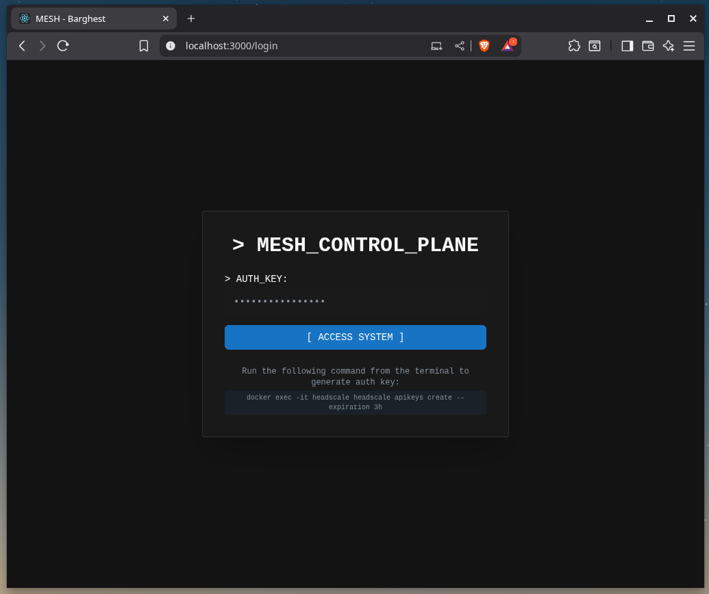
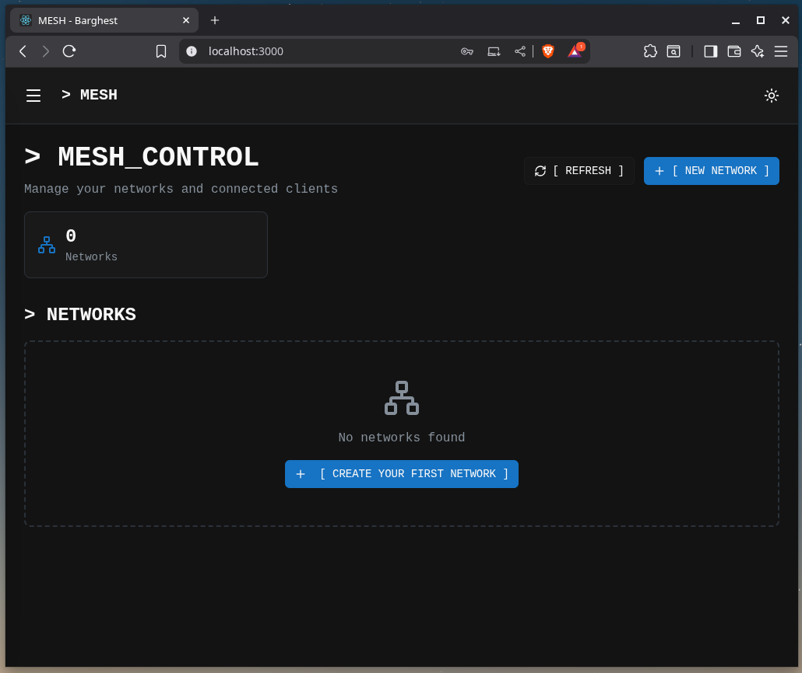
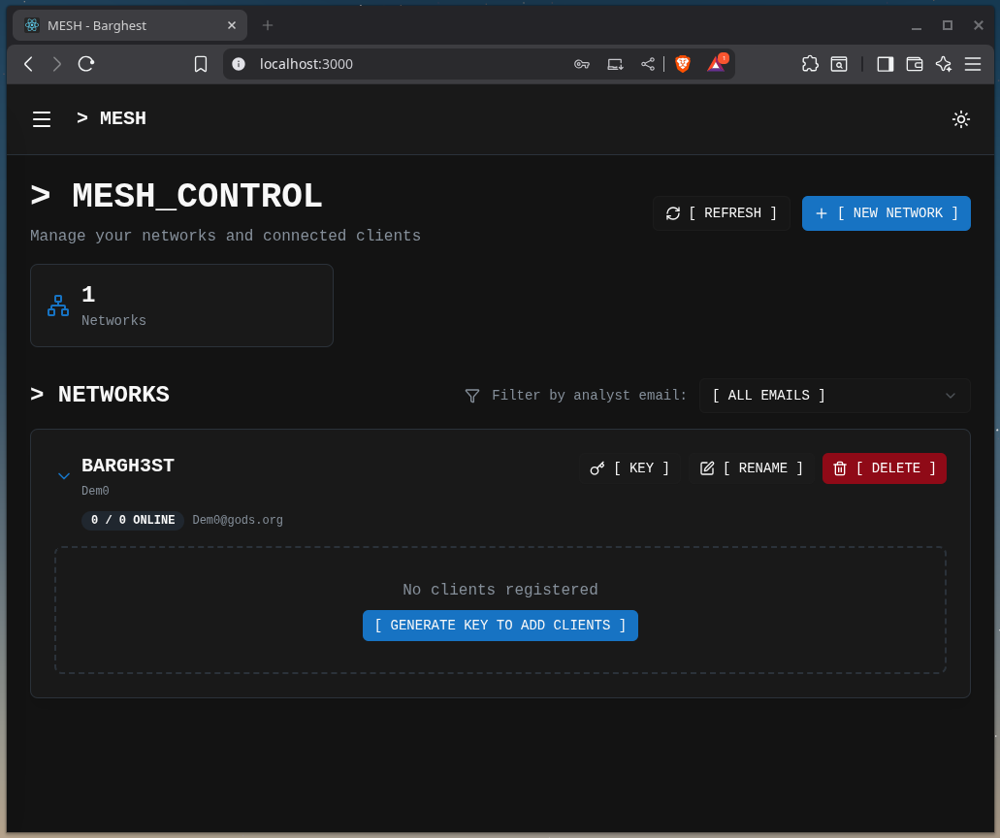

# Control plane setup

The control plane coordinates your MESH network. We use Docker for easy deployment.

## Step 1: Clone the Repository

```bash
git clone https://github.com/BARGHEST-ngo/mesh.git
cd mesh/mesh-control-plane
```

## Step 2: Configure Headscale

Create a configuration file:

```bash
mkdir -p config
cat > config/config.yaml << EOF
server_url: https://your-domain.com
listen_addr: 0.0.0.0:8080
metrics_listen_addr: 0.0.0.0:9090

grpc_listen_addr: 0.0.0.0:50443
grpc_allow_insecure: false

private_key_path: /var/lib/headscale/private.key
noise_private_key_path: /var/lib/headscale/noise_private.key
base_domain: your-domain.com

ip_prefixes:
  - 100.64.0.0/10
  - fd7a:115c:a1e0::/48

derp:
  server:
    enabled: true
    region_id: 999
    region_code: "custom"
    region_name: "Custom DERP"
    stun_listen_addr: "0.0.0.0:3478"

  urls:
    - https://controlplane.tailscale.com/derpmap/default

  auto_update_enabled: true
  update_frequency: 24h

database:
  type: sqlite3
  sqlite:
    path: /var/lib/headscale/db.sqlite

log:
  level: info
  format: text

dns_config:
  override_local_dns: false
  nameservers:
    - 1.1.1.1
    - 8.8.8.8
  magic_dns: true
  base_domain: mesh.local

acl_policy_path: /etc/headscale/acl.yaml
EOF
```

!!! important "Replace Configuration Values"
    Replace `your-domain.com` with your actual domain or server IP address. If you want to use your own DERP server, you should change the `urls` to your own. You can learn more about DERP here. We use Tailscale's DERP relay's by default.

## Step 3: Create ACL Policy

Access Control Lists (ACLs) define which nodes can communicate with each other.

```bash
cat > config/acl.yaml << EOF
acls:
  - action: accept
    src:
      - "*"
    dst:
      - "*:*"
EOF
```

!!! warning "Permissive ACL"
    The default configuration allows all nodes to communicate with each other. For production deployments, see the [ACL documentation](../installation/control-plane.md#access-control-lists-acls) for more restrictive policies.

## Step 4: Start the control plane

```bash
docker-compose up -d
```

Verify the containers are running:

```bash
docker ps
```

You should see containers for:

- `headscale` - The control plane server
- `headscale-ui` - The web management interface

## Step 5: Access the Web UI

The control plane includes a web-based management interface. Access it at:

- **Local access**: `https://localhost:3000/login`
- **Remote access**: `https://your-domain:8443/login`

!!! tip "Self-Signed Certificate"
    The web UI uses a self-signed certificate by default. Your browser will show a security warning - this is expected. Click "Advanced" and proceed to the site. You should use a reverse proxy to serve the web UI over HTTPS. **It is required for the control plane to be accessible on HTTPS publicly**

## Step 6: Create an API Key

Before using the web UI, create an API key:

```bash
docker exec headscale headscale apikeys create --expiration 90d
```

**Example output:**

```
abc123def456ghi789jkl012mno345pqr678stu901vwx234yz
```

!!! important "Copy your API key"
    Copy this key immediately - you won't be able to see it again.

## Step 7: Connect to the Web UI

1. Open the web UI in your browser
2. Enter your **Ccntrol plane URL**: `http://localhost:3000`
3. Paste your **API Key** from Step 6
4. Click **ACCESS SYSTEM**



You're now connected to the control plane.

## Step 8: Create a new network

Before creating pre-authentication keys for nodes, you need to create a network (or namespace). This should be the network that you'll join nodes to for a forensics mesh.

**Using the Web UI (Recommended):**

- Navigate to the **[ NEW NETWORK ]** tab in the sidebar



- Enter the details for the forensics mesh you're wanting to create


- Your network is now created and ready for nodes



- (Optional) Modify ACLs to ensure nodes are segregated properly

For production deployments, see the [ACL documentation](../installation/control-plane.md#access-control-lists-acls).

## Step 9: Create a Pre-authentication key

Pre-auth keys allow nodes to join the mesh without interactive authentication. You'll need this key to connect clients.

1. Click the **[ GENERATE KEY TO ADD CLIENTS ]** tab
2. Select which type of node you want to create

    

3. Configure the key accordingly:
   - **Reusable**: allows multiple devices to use the same key
   - **Ephemeral**: destroys the node after disconnecting
   - **Expiration**: 24 hours (or longer for your use case)
4. Click **GENERATE**
5. **Copy the key immediately** - you won't see it again. Use this for your analyst node connection, or send to your client for a forensics node endpoint.

!!! tip "Save Your Pre-auth key"
    Save this key securely - you'll need it to connect both the analyst client and endpoint clients to the mesh.

## Verification

Verify your control plane is running correctly:

```bash
# Check container status
docker ps

# Check control plane logs
docker logs headscale

# Test API endpoint
curl http://localhost:8080/health
```

## Next steps

Your control plane is now ready. The next step is to install the analyst client on your acquision node.

For detailed control plane configuration, see the [Control plane documentation](../installation/control-plane.md).

---

← [Previous: Prerequisites](prerequisites.md) | [Next: Analyst client Setup](analyst-client.md) →
