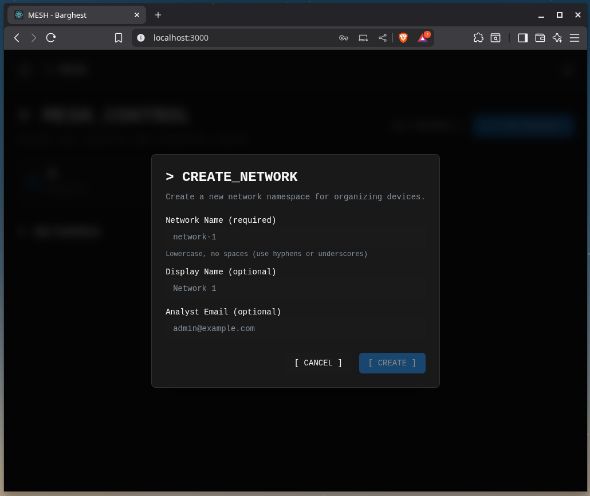
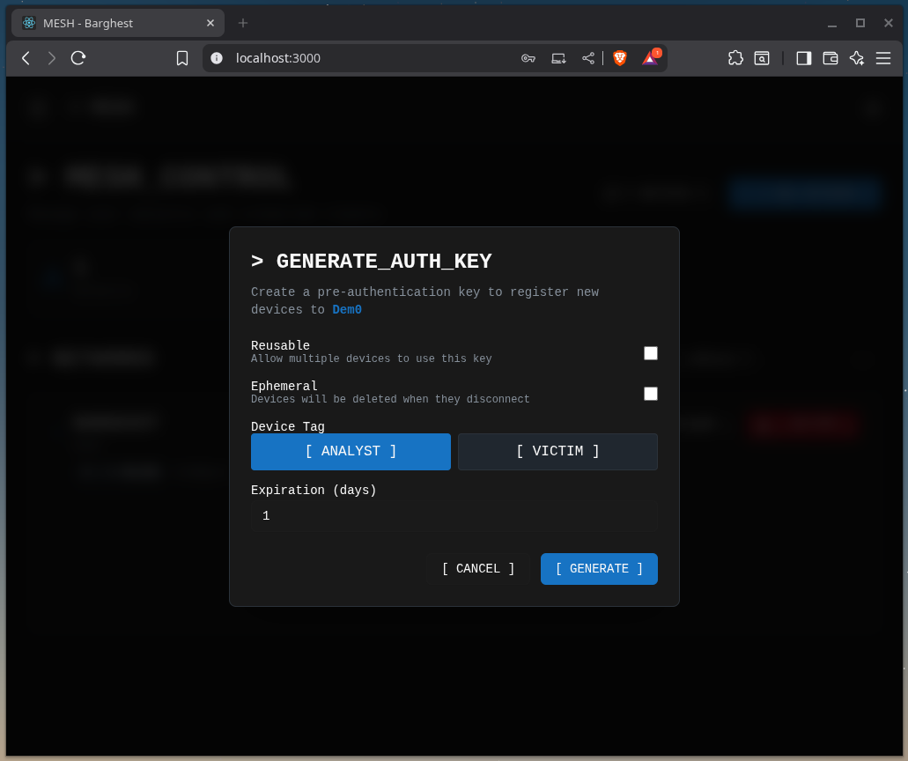

# Control plane setup

The control plane coordinates your MESH network. We use Docker for easy deployment.

## Step 1: Install prerequisites

Install Docker and Docker Compose if you haven't already. You can find the instructions for your specific operating system [here](https://docs.docker.com/get-docker/).

The only other prerequisites are Git and Task. Full install instructions for Task are [here](https://taskfile.dev/docs/installation). The short version:

```bash
# Linux (Ubuntu/Debian)
sudo snap install task --classic

# macOS
brew install go-task
```

## Step 2: Clone the Repository

```bash
git clone https://github.com/BARGHEST-ngo/mesh.git
cd mesh
```

## Step 3: Configure and start the control plane

```bash
task controlPlane
```

When first run, you will be prompted for the type of control plane you want to deploy. You can choose between an ephemeral control plane that runs on your local workstation and is only accessible using a third party tunneling service, or a persistent control plane run on a virtual private server (VPS) that is accessible from the internet.

Verify the containers are running:

```bash
docker compose ps
docker compose logs
```

You should see containers for:

- `headscale` - The control plane server
- `mesh-ui` - The MESH web management interface

## Step 4: Access the Web UI

The control plane includes a web-based management interface. Access it at:

- **Local access**: `http://localhost/login`
- **Remote access**: `https://your-domain.com/login`

You will be prompted to enter an API key in order to use the management functionality, which you can do by running the following:

```bash
task apikey
```

**Example output:**

```
hskey-api-RJyX-n70PaGg-cOh40d9NlJn5FkLTOpwS6ajrkvGrv-WLjAU4eFauE4iK59gVYh4m7O4rqAykxa7e
```

Enter this key into the web UI and click **ACCESS SYSTEM**.


You're now connected to the control plane.

## Step 5: Create a new network

Before creating pre-authentication keys for nodes, you need to create a network (or namespace). This should be the network that you'll join nodes to for a forensics mesh.

- Navigate to the **[ NEW NETWORK ]** tab in the sidebar


- Enter the details for the forensics mesh you're wanting to create



- Your network is now created and ready for nodes


- (Optional) Modify ACLs to ensure nodes are segregated properly

For production deployments, see the [ACL documentation](../reference/policies.md).

## Step 6: Create a Pre-authentication key

Pre-auth keys allow nodes to join the mesh without interactive authentication. You'll need this key to connect clients.

1. Click the **[ GENERATE KEY TO ADD CLIENTS ]** tab
2. Select which type of node you want to create

    

3. Configure the key accordingly:
   - **Reusable**: allows multiple devices to use the same key
   - **Ephemeral**: destroys the node after disconnecting
   - **Expiration**: 24 hours (or longer for your use case)
4. Click **GENERATE**
5. **Copy the key immediately** - you won't see it again. Use this for your analyst node connection, or send to your client for a forensics node endpoint.

!!! tip "Save Your Pre-auth key"
    Save this key securely - you'll need it to connect both the analyst client and endpoint clients to the mesh.

## Verification

Verify your control plane is running correctly:

```bash
# Check container status
docker ps

# Check control plane logs
docker compose logs

# Test control plane API endpoint
curl https://your-domain.com/health
```

## Next steps

Your control plane is now ready. The next step is to install the analyst client on your acquisition node.

---

[Next: Analyst client Setup](analyst-client.md) →
